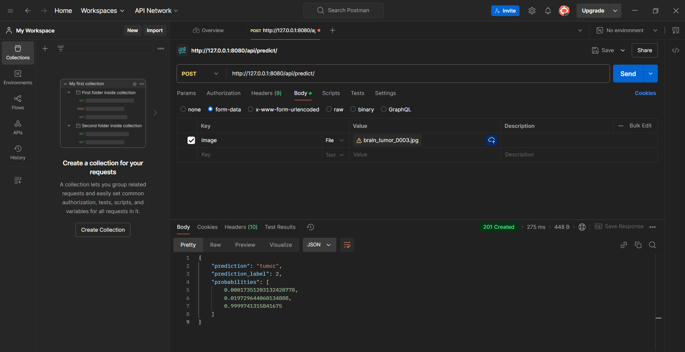

# Brain Tumor MRI Classification Project

## Project Overview

The goal of this project is to train a classifier that can determine whether A MRI scan of a brain is a glioma, menin or tumor. The main goal is to use Explainable AI on our trained models to determine whether the model is actually learning usuable pattern in the data and not the noise of the scans.

## Dataset

The dataset used for this project consists of MRI scans of human brains.

*   **Type**: MRI scans
*   **Classes**: 3 types of brain tumors Meningioma, Glioma, Pituitary tumor)
*   **Source**: Downloaded from Kaggle using `kagglehub`, dataset identifier: "orvile/brain-cancer-mri-dataset".
*   **Approximate size**: Around 6000 scans.
*   **Key Preprocessing Steps**:
    *   Images are converted to grayscale.
    *   Images are resized to 224x224 pixels.
    *   Pixel intensities are normalized to a [0,1] range (typically by ToTensor transform).
    *   Data augmentation techniques (random rotation, zoom, horizontal flip, brightness adjustment) are applied to the training set to improve model generalization.
    *   The dataset is split into training (70%), validation (15%), and test (15%) sets. This split is stratified to ensure proportional representation of each class in all sets.

## Installation

To set up and run this project, please follow these steps:

1.  **Clone the repository**:
    ```bash
    git clone <repository-url>
    cd <repository-name>
    ```

2.  **Install dependencies using Pipenv** (Python 3.11 is required, as specified in the `Pipfile`):
    ```bash
    pipenv install
    ```

3.  **Activate the Pipenv shell**:
    ```bash
    pipenv shell
    ```

4.  **Download the dataset**:
    Run the downloader script from the project's root directory:
    ```bash
    python project_name/utils/downloader.py
    ```
    This will download the dataset from Kaggle and place it into the `./data/` directory.

## Usage

### ResNet Model Training

To train the main ResNet-based model:

```bash
python main.py main_model
```

The script will train the model using the data in `./data/`. The trained model (state dictionary) will be saved to `outputs/models/resnet_model.pth`.

### SVM Baseline Model Training

To train the SVM baseline model:

```bash
python main.py baseline_model
```

### SVM Baseline Model Training with instant evaluation

To train the SVM baseline model:

```bash
python main.py eval_baseline
```

### Loading ResNet model from rest_api into local environmet

To load the ResNet model:

```bash
python main.py load
```

### Evaluate ResNet model on the test data (only possible after main model is loaded)

To evaluate the ResNet model:

```bash
python main.py eval_main
```

### Grad_cam picture of one of the test pictures

To see how the grad_cam works:

```bash
python main.py explain
```

### Model deployment through api
```
cd rest_api
python manage.py runserver
```

Django will automatically return the url of the server, which would be http://127.0.0.1:8000/ if ran locally. The api can be be accessed through a post request with one key-value pair in the form data, key: image. This can done via curl or postman

Curl:
```
curl -X POST http://localhost:8000/api/predict/ \
  -F image=@/path/to/your/image.jpg
```

Postman:



## Model Architecture

### Main Model (ResNet-based)

*   **Input Data**: 224 by 224 normalized greyscale MRI images (Normalisation based on ImageNet mean and stdev)
*   **Feature Extractor**: Resnet50 backbone that extracts features
*   **Classification Head**: calssification head of 512 nodes that uses features from the backbone to do classification
### Baseline Model (SVM)

*   **Input Data**: 224 by 224 greyscale MRI images
*   **Model**: Stochastic gradient descent classifier
*   **Hyperparameter Tuning**: partial fits because we can't load all the data in our limited RAM
    *   **Parameters**: `C` (regularization parameter) 


## Results

This section will be updated with model performance metrics (e.g., accuracy, F1-score) after comprehensive training and evaluation of the models.

## Contributors

*   Ebe Kort (e.kort.3@student.rug.nl)
*   Senne Hollard (s.i.t.hollard@student.rug.nl)
*   Tjeerd Morsch (t.p.r.morsch@student.rug.nl)
*   Alexandra Andrei
