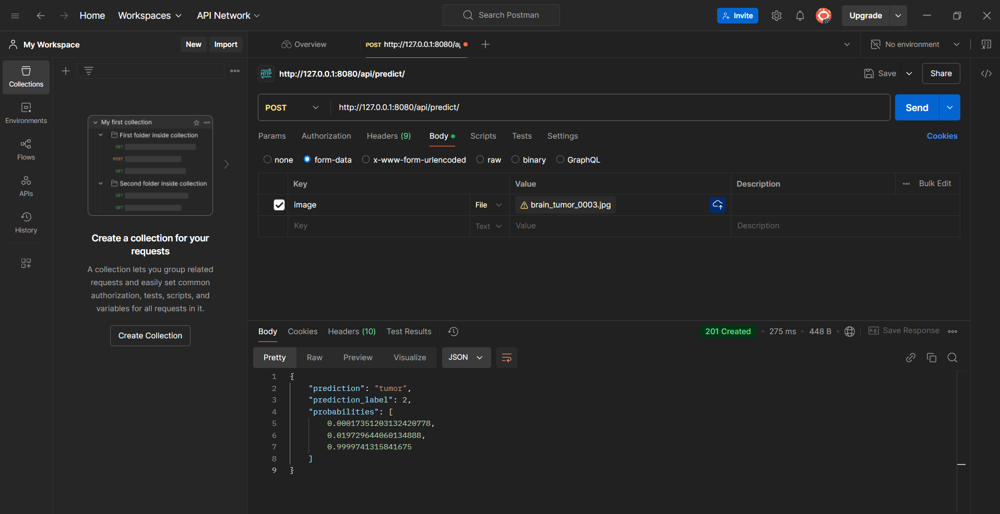

# Brain Tumor MRI Classification Project

## Project Overview

The primary goal of this project is to develop a machine learning model capable of accurately classifying Magnetic Resonance Imaging (MRI) scans into three distinct types of brain tumors. A significant emphasis is placed on incorporating explainability features to understand the model's decision-making process, particularly for the Support Vector Machine (SVM) baseline.

## Dataset

The dataset used for this project consists of MRI scans of human brains.

*   **Type**: MRI scans
*   **Classes**: 3 types of brain tumors (specific names depend on the dataset structure, e.g., Meningioma, Glioma, Pituitary tumor)
*   **Source**: Downloaded from Kaggle using `kagglehub`, dataset identifier: "orvile/brain-cancer-mri-dataset".
*   **Approximate size**: Around 6000 scans.
*   **Key Preprocessing Steps**:
    *   Images are converted to grayscale.
    *   Images are resized to 224x224 pixels.
    *   Pixel intensities are normalized to a [0,1] range (typically by ToTensor transform).
    *   Data augmentation techniques (random rotation, zoom, horizontal flip, brightness adjustment) are applied to the training set to improve model generalization.
    *   The dataset is split into training (70%), validation (15%), and test (15%) sets. This split is stratified to ensure proportional representation of each class in all sets.

## Installation

To set up and run this project, please follow these steps:

1.  **Clone the repository**:
    ```bash
    git clone <repository-url>
    cd <repository-name>
    ```

2.  **Install dependencies using Pipenv** (Python 3.11 is required, as specified in the `Pipfile`):
    ```bash
    pipenv install
    ```

3.  **Activate the Pipenv shell**:
    ```bash
    pipenv shell
    ```

4.  **Download the dataset**:
    Run the downloader script from the project's root directory:
    ```bash
    python project_name/utils/downloader.py
    ```
    This will download the dataset from Kaggle and place it into the `./data/` directory.

## Usage

### ResNet Model Training

To train the main ResNet-based model:

```bash
python main.py main_model
```

The script will train the model using the data in `./data/`. The trained model (state dictionary) will be saved to `outputs/models/resnet_model.pth`.

### SVM Baseline Model Training

To train the SVM baseline model:

```bash
python main.py baseline_model
```

### Model deployment through api
```
cd rest_api
python manage.py runserver
```

Django will automatically return the url, the server is running at which would be http://127.0.0.1:8000/ if ran locally. The api can be be accessed through a post request with one key-value pair in the form data, key: image. This can done via curl or postman

Curl:
```
curl -X POST http://localhost:8000/api/predict/ \
  -F image=@/path/to/your/image.jpg
```

Postman:



This script will:
*   Load and preprocess the data.
*   Perform hyperparameter tuning for the SVM using `GridSearchCV`.
*   Print classification results (accuracy, classification report) to the console.
*   If a linear kernel is selected as the best model by `GridSearchCV`, feature importance plots (reshaped coefficient weights) will be saved as images in the `outputs/svm_explainability/` directory.

## Model Architecture

### Main Model (ResNet-based)

*   **Feature Extractor**: A pre-trained ResNet50 model is used. The original fully connected layer of ResNet50 is replaced with an identity layer to extract features from the convolutional base.
*   **Classification Head**: A custom classification head is added on top of the ResNet50 features. This head consists of one or more linear layers (configurable, e.g., `[512]`) with ReLU activations, followed by a final linear layer for outputting scores for the 3 tumor classes.

### Baseline Model (SVM)

*   **Input Data**: Uses flattened 224x224 grayscale image data as input features.
*   **Model**: A Support Vector Machine (SVM) classifier.
*   **Hyperparameter Tuning**: `GridSearchCV` is employed to find the optimal hyperparameters.
    *   **Kernels**: 'linear' and 'rbf' are tested.
    *   **Parameters**: `C` (regularization parameter) and `gamma` (for 'rbf' kernel) are tuned.
*   **Explainability**: If the linear kernel is chosen, the model's coefficients are reshaped into 224x224 images and saved to visualize feature importance.

## Results

This section will be updated with model performance metrics (e.g., accuracy, F1-score) after comprehensive training and evaluation of the models.

## Contributors

*   Ebe Kort (e.kort.3@student.rug.nl)
*   Senne Hollard (s.i.t.hollard@student.rug.nl)
*   Tjeerd Morsch (t.p.r.morsch@student.rug.nl)
